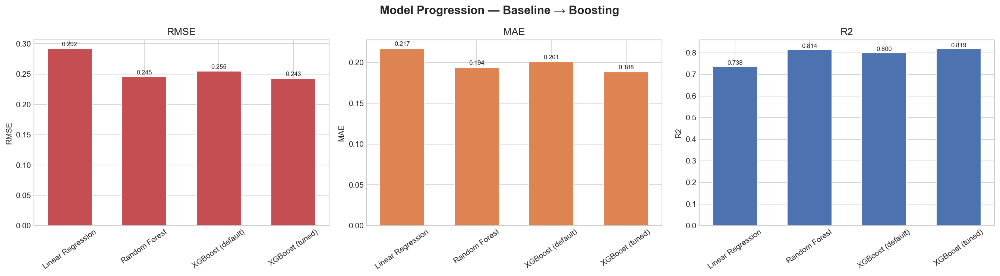
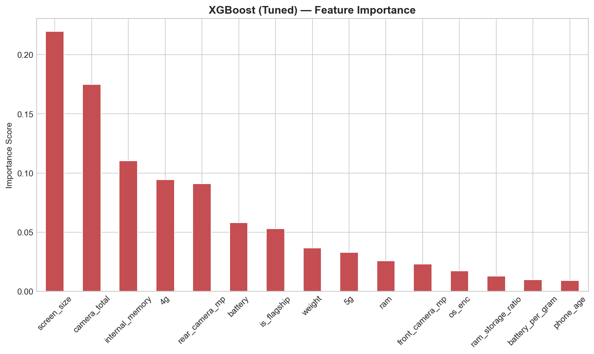
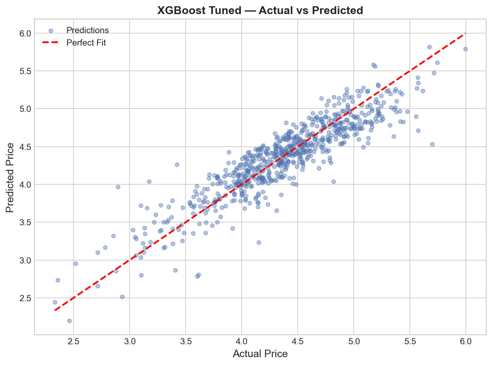
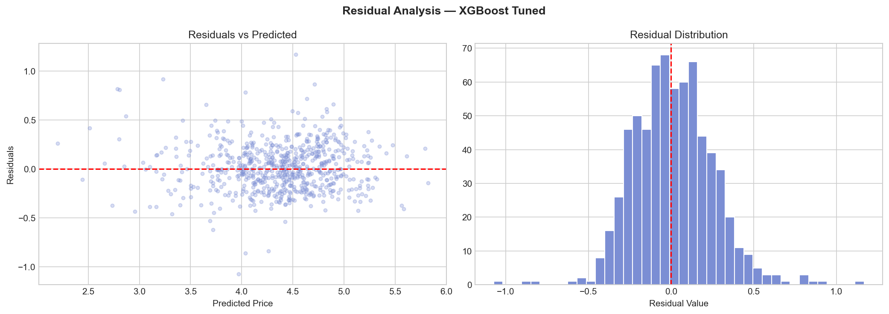

# Phone Used Price Prediction — ML Regression Pipeline

> Regression pipeline to predict normalized used phone prices using hardware specs and engineered features. Progression from Linear Regression to tuned XGBoost with a naive benchmark comparison.

---

## Problem Statement

Predict the **normalized used price** of a smartphone given its hardware specifications, connectivity, and usage history.

A naive baseline exists — `normalized_new_price` is available in the dataset but using it as a feature would be direct data leakage. It is used only as a benchmark comparison at the end to validate that the model learns genuine pricing signals from hardware alone.

---

## Project Structure
```
phone-price-prediction/
│
├── train.py
├── phonedata.csv
├── requirements.txt
└── outputs/
    ├── model_comparison.png
    ├── feature_importance.png
    ├── actual_vs_predicted.png
    └── residuals.png
```

---

## Dataset

| Property | Detail |
|----------|--------|
| Target | `normalized_used_price` |
| Benchmark | `normalized_new_price` (comparison only, never used as feature) |
| Total records | 3,454 phones |
| Era | 2015 – 2020 |
| Source | [add dataset link here] |

**Raw Features:** device brand, OS, screen size, 4G/5G, rear/front camera MP, internal memory, RAM, battery, weight, release year, days used

**Nulls handled:** rear camera (179), front camera (2), internal memory (4), RAM (4), battery (6), weight (7) — all filled with column median.

---

## Feature Engineering

6 features engineered from raw specs:

| Feature | Description |
|---------|-------------|
| `camera_total` | Rear + front camera MP combined |
| `ram_storage_ratio` | RAM / internal memory — memory efficiency signal |
| `battery_per_gram` | Battery / weight — energy density proxy |
| `is_flagship` | 1 if RAM >= 6GB and storage >= 128GB |
| `phone_age` | 2020 - release year |
| `connectivity_score` | 5G=2, 4G=1, neither=0 |

Final feature count after engineering and encoding: **19 features**

---

## Workflow
```
Load & Null Handling → Feature Engineering → Train/Test Split (80/20)
    → Linear Regression → Random Forest
    → XGBoost (default) → XGBoost (GridSearchCV)
    → Benchmark Comparison
```

---

## Results

| Model | RMSE | MAE | R² | CV R² |
|-------|------|-----|----|-------|
| Linear Regression | 0.2917 | 0.2168 | 0.7378 | 0.7429 |
| Random Forest | 0.2455 | 0.1936 | 0.8143 | 0.7969 |
| XGBoost (default) | 0.2548 | 0.2007 | 0.8000 | 0.7729 |
| **XGBoost (tuned)** | **0.2426** | **0.1884** | **0.8186** | **0.8092** |

### Benchmark Comparison

| | RMSE | R² |
|--|------|-----|
| normalized_new_price (naive baseline) | 0.9452 | -1.7528 |
| XGBoost tuned (our model) | 0.2426 | 0.8186 |

The naive baseline scores R² = -1.75 — it actually performs worse than predicting the mean. Our model achieves R² = 0.82 using hardware specs alone, confirming the engineered features carry real predictive signal.

### Best XGBoost Parameters
```
colsample_bytree: 0.8
learning_rate:    0.1
max_depth:        3
n_estimators:     200
subsample:        0.8
```

---

## Visualizations

**Model Progression**


**XGBoost Feature Importance**


**Actual vs Predicted**


**Residual Analysis**


---

## Key Findings

Top features driving used phone price:

| Feature | Importance |
|---------|------------|
| screen_size | 0.220 |
| camera_total | 0.175 |
| internal_memory | 0.111 |
| 4g | 0.095 |
| rear_camera_mp | 0.090 |

Screen size and camera quality are the strongest predictors — consistent with consumer behavior in the 2015–2020 phone market. Engineered features like `camera_total` and `is_flagship` rank higher than several raw features, validating the feature engineering step.

---

## Tech Stack

- Python 3.x
- pandas, numpy
- scikit-learn
- xgboost
- matplotlib, seaborn

---

## How to Run
```bash
pip install -r requirements.txt
python train.py
```

---

## requirements.txt
```
pandas
numpy
scikit-learn
xgboost
matplotlib
seaborn

```
